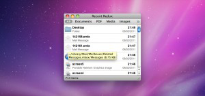

# Recent Redux

Recent Redux is a tool keeping track of files and folders which have been recently used on your computer. It is updated live and allows for direct access to these files and folders. If you want, you can also define filters to show you just those files you need.

## Features

### Live File Access Monitoring

Recent Redux shows a live updated list of recently accessed local files and folders with file name, type, date and time. The tooltip contains additional information on file or folder size and path. Decide where to search and for many past hours Recent Redux should monitor recently accessed files.

### Action!

Right in the context menu: Preview, open and copy files, copy their file paths and show them in Finder. Recent Redux also supports drag and drop for easily putting your recent files where you want them to be. E-mail sharing is supported, too (Mail.app, Entourage 2008, Outlook 2011 and Postbox).

### Filtering

Use the filter bar to instantly narrow down the list of recent files. Modify and sort the filter bar as you like it. Use pre-defined filters for documents, PDF files, media files, images, folders and applications, or create your own filters.

### For Your Convenience

Use the built-in system-wide hotkey to activate Recent Redux, no matter where you are. If you like to, make Recent Redux to always stay in front of all other windows on your screen. Even easier to find: Open the Dock Menu for lightning-fast access to the ten most recent files.

### Screenshot

